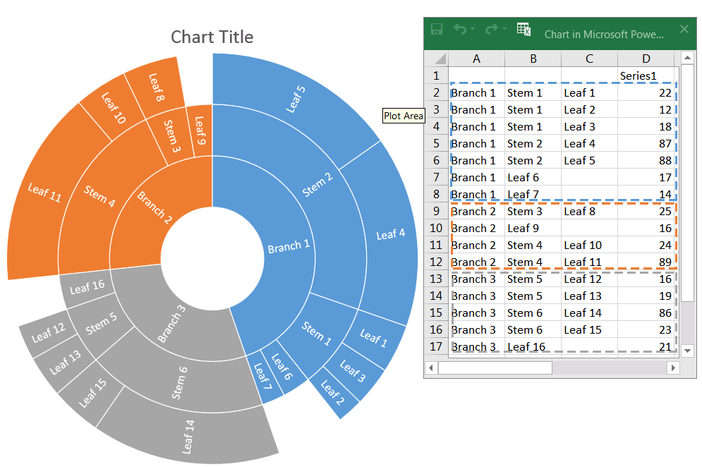

{} 

This page contains release notes for Aspose.Slides for C++ 19.12

{} 
## **Supported Platforms**
- Aspose.Slides for C++ for Windows (Microsoft Visual C++).
- Aspose.Slides for C++ for Linux (Clang).


|**Key**|**Summary**|**Category**|
| :- | :- | :- |
|SLIDESCPP-1822|Use Aspose.Slides for .NET 19.12 features|Feature|
|SLIDESNET-41274|[Add color to Data Points](/slides/cpp/formatting-charts/#formattingcharts-applycolortodatapoints)|Feature|
|SLIDESNET-41487|[Restrict printing in PDF file](/slides/cpp/converting-presentation-to-pdf/#convertingpresentationtopdf-setpdfaccesspermissions)|Feature|
|SLIDESNET-41510|[PDF access permissions](/slides/cpp/converting-presentation-to-pdf/#convertingpresentationtopdf-setpdfaccesspermissions)|Feature|
|SLIDESNET-38950|ODP to PDF: Bullets numbering is missing|Enhancement|
|SLIDESNET-41184|Slides are not placed into proper sections|Enhancement|
|SLIDESCPP-2140|Add support for the CodePorting.Native.Cs2Cpp.API package|Enhancement|
|SLIDESCPP-2178|Improve the performance of saving images in PNG format|Enhancement|
## **Public API Changes**
### **Data Points of Treemap and Sunburst Chart**
Among other types of PowerPoint charts, there are two "hierarchical" types - **Treemap** and **Sunburst** chart (also known as Sunburst Graph, Sunburst Diagram, Radial Chart, Radial Graph or Multi Level Pie Chart). These charts display hierarchical data organized as a tree - from leaves to the top of the branch. Leaves are defined by the series data points, and each subsequent nested grouping level defined by the corresponding category. Aspose.Slides for C++ allows to format data points of Sunburst Chart and Treemap in C++.

Here is a Sunburst Chart, where data in Series1 column define the leaf nodes, while other columns define hierarchical datapoints:




Let’s start with adding a new Sunburst chart to the presentation:

``` cpp

 System::SharedPtr<Presentation> pres = System::MakeObject<Presentation>();

System::SharedPtr<IChart> chart = pres->get_Slides()->idx_get(0)->get_Shapes()->AddChart(Aspose::Slides::Charts::ChartType::Sunburst, 100.0f, 100.0f, 450.0f, 400.0f);

// ...

```

Read more about [**Creating Sunburst Chart**](/slides/cpp/adding-charts/#addingcharts-creatingsunburstchart)


If there is a need to format data points of the chart, we should use the following:

[**IChartDataPointLevelsManager**](https://apireference.aspose.com/cpp/slides/class/aspose.slides.charts.i_chart_data_point_levels_manager/)**, [IChartDataPointLevel ](https://apireference.aspose.com/cpp/slides/class/aspose.slides.charts.i_chart_data_point_level/)**classes and [**IChartDataPoint::get_DataPointLevels()**](https://apireference.aspose.com/cpp/slides/class/aspose.slides.charts.i_chart_data_point/#ac619638c85f84a6127a7ce62523e0931)** **method provide access to format data points of Treemap and Sunburst charts. [**IChartDataPointLevelsManager**](https://apireference.aspose.com/cpp/slides/class/aspose.slides.charts.i_chart_data_point_levels_manager/)** **is used for accessing multi-level categories - it represents the container of [**IChartDataPointLevel** ](https://apireference.aspose.com/cpp/slides/class/aspose.slides.charts.i_chart_data_point_level/)objects. Basically it is a wrapper for [**IChartCategoryLevelsManager** ](https://apireference.aspose.com/cpp/slides/class/aspose.slides.charts.i_chart_category_levels_manager/)with the properties added specifically for data points. [**IChartDataPointLevel** ](https://apireference.aspose.com/cpp/slides/class/aspose.slides.charts.i_chart_data_point_level/)class has two methods: [**get_Format()** ](https://apireference.aspose.com/cpp/slides/class/aspose.slides.charts.i_chart_data_point_level/#a00caa6a048ad98a66ab56a5ddb196697)and [**get_DataLabel()** ](https://apireference.aspose.com/cpp/slides/class/aspose.slides.charts.i_chart_data_point_level/#a5ab377b372199eb561792e9ba18acf25)which provide access to corresponding settings.

### **Show Data Point Value**
Show value of "Leaf 4" data point:

``` cpp

 System::SharedPtr<IChartDataPointCollection> dataPoints = chart->get_ChartData()->get_Series()->idx_get(0)->get_DataPoints();

dataPoints->idx_get(3)->get_DataPointLevels()->idx_get(0)->get_Label()->get_DataLabelFormat()->set_ShowValue(true);

```


### **Set Data Point label and its color**
` `Set "Branch 1" data label to show a series name ("Series1") instead of the category name. Then set the text color to yellow:

``` cpp

 System::SharedPtr<IDataLabel> branch1Label = dataPoints->idx_get(0)->get_DataPointLevels()->idx_get(2)->get_Label();

branch1Label->get_DataLabelFormat()->set_ShowCategoryName(false);

branch1Label->get_DataLabelFormat()->set_ShowSeriesName(true);


branch1Label->get_DataLabelFormat()->get_TextFormat()->get_PortionFormat()->get_FillFormat()->set_FillType(Aspose::Slides::FillType::Solid);

branch1Label->get_DataLabelFormat()->get_TextFormat()->get_PortionFormat()->get_FillFormat()->get_SolidFillColor()->set_Color(System::Drawing::Color::get_Yellow());

```


### **Set Data Point Branch Color**
` `Change color of "Steam 4" branch:

``` cpp

 System::SharedPtr<IFormat> steam4Format = dataPoints->idx_get(9)->get_DataPointLevels()->idx_get(1)->get_Format();

steam4Format->get_Fill()->set_FillType(Aspose::Slides::FillType::Solid);

steam4Format->get_Fill()->get_SolidFillColor()->set_Color(System::Drawing::Color::FromArgb(255, 0, 176, 240));

```


### ` `**IPdfOptions::get_AccessPermissions() and IPdfOptions::set_AccessPermissions() methods have been added**
` `[**get_AccessPermissions()**](https://apireference.aspose.com/cpp/slides/class/aspose.slides.export.i_pdf_options/#ac80b9006c6eab82c84f87dc0235f081b) and [**set_AccessPermissions()**](https://apireference.aspose.com/cpp/slides/class/aspose.slides.export.i_pdf_options/#ac2b89307d944084a00853ff3dfa070e3) methods have been added to [**IPdfOptions**](https://apireference.aspose.com/cpp/slides/class/aspose.slides.export.i_pdf_options/)** **interface and [**PdfOptions**](https://apireference.aspose.com/cpp/slides/class/aspose.slides.export.pdf_options/)** **class. All possible values of this property are defined in the [**PdfAccessPermissions**](https://apireference.aspose.com/cpp/slides/namespace/aspose.slides.export/#a8a80eed4177a9fe0cefe91999e4ec353) enumeration. These values allow you to restrict access rights to a PDF document such as printing, modify the contents, copy text and graphics, add or modify text annotations, create or modify interactive form fields, extract text and graphics in support of accessibility to users with disabilities, create bookmarks, manipulate pages, etc. The values of this enumeration may be combined.
##### **Example**
The example below demonstrates how to set access permissions to a PDF document only for printing in high quality.

``` cpp

 auto pdfOptions = System::MakeObject<PdfOptions>();

pdfOptions->set_Password(u"my_password");

pdfOptions->set_AccessPermissions(Aspose::Slides::Export::PdfAccessPermissions::PrintDocument | Aspose::Slides::Export::PdfAccessPermissions::HighQualityPrint);


auto presentation = System::MakeObject<Presentation>();

presentation->Save(pdfFilePath, Aspose::Slides::Export::SaveFormat::Pdf, pdfOptions);

```


### **ISlideCollection::AddClone() method has been added**
[**AddClone()**](https://apireference.aspose.com/cpp/slides/class/aspose.slides.i_slide_collection/#a46981dac8b18355531a04a70c70c444b) method has been added to [**ISlideCollection**](https://apireference.aspose.com/cpp/slides/class/aspose.slides.i_slide_collection/)** **interface and [**SlideCollection**](https://apireference.aspose.com/cpp/slides/class/aspose.slides.slide_collection/)** **class. This method allows adding a slide clone into a specified section.
#### **Method declaration**
``` cpp

 /// <summary>

/// Adds a copy of a specified slide to the end of the specified /// section.

/// </summary>

/// <param name="sourceSlide">Slide to clone.</param>

/// <param name="section">Section for a new slide.</param>

/// <returns>New slide.</returns>

/// <exception cref="ArgumentNullException"/>

/// <exception cref="PptxEditException"/>

System::SharedPtr<ISlide> AddClone(System::SharedPtr<ISlide> sourceSlide, System::SharedPtr<ISection> section);


```
#### **Example**
``` cpp

 auto presentation = MakeObject<Presentation>();

presentation->get_Slides()->idx_get(0)->get_Shapes()->AddAutoShape(ShapeType::Rectangle, 200.0f, 50.0f, 300.0f, 100.0f);

presentation->get_Sections()->AddSection(u"Section 1", presentation->get_Slides()->idx_get(0));

auto section2 = presentation->get_Sections()->AppendEmptySection(u"Section 2");

presentation->get_Slides()->AddClone(presentation->get_Slides()->idx_get(0), section2);

// Now the second section contains a copy of the first slide.


```


