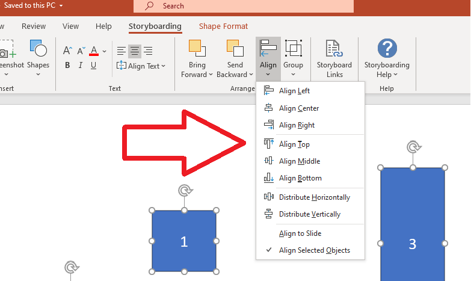
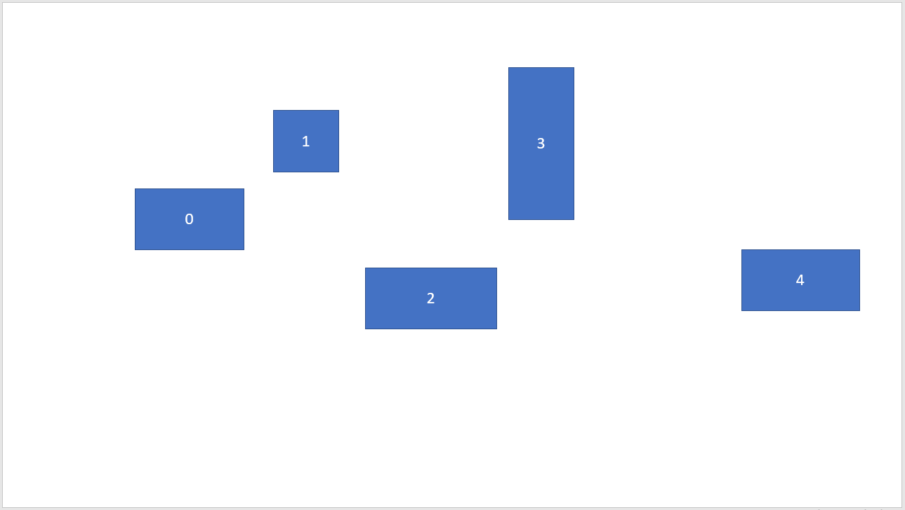

{} 

This page contains release notes for Aspose.Slides for C++ 20.5.

{} 
## **Supported platforms**
- Aspose.Slides for C++ for Windows (Microsoft Visual C++).
- Aspose.Slides for C++ for Linux (Clang).
## **New Features and Enhancements**

|**Key**|**Summary**|**Category**|
| :- | :- | :- |
|SLIDESNET-38923|Feature to identify read-protected and write-protected presentations|Feature |
|SLIDESNET-41786|Add the ability to validate password to modify|Feature|
|SLIDESNET-37280|Support for Mathematical Equations (OMML)|Feature|
|SLIDESNET-40011|Align Multiple shapes in one line|Feature|
|SLIDESNET-38545|Get real table row height, after the long text is added to cell|Enhancement|
|SLIDESNET-41621|Importing Excel EMF image has broken aspect ratio|Enhancement|
## **Other Improvements and Changes**

|**Key**|**Summary**|**Category**|
| :- | :- | :- |
|SLIDESCPP-2209|[Use Aspose.Slides for .NET 20.5 features](https://docs.aspose.com/display/slidesnet/Aspose.Slides+for+.NET+20.5+Release+Notes)|Enhancement |
|SLIDESCPP-2129|Add support for document digital signing|Enhancement|

## **Public API Changes**
Shapes alignment support has been added

Shapes alignment feature is used to change the placement of selected shapes on the slide. You may align shapes to the margins or the edge of the slide or align them relative to each other.




[**SlideUtil::AlignShapes()**](https://apireference.aspose.com/slides/cpp/class/aspose.slides.util.slide_util#a03a73955adaefd4d7a65d21ab0f68f77) 
method and [**ShapesAlignmentType**](https://apireference.aspose.com/slides/cpp/namespace/aspose.slides#aeb3015a196294029a0ee1f545bc5887f) 
enum has been added to provide options from the picture above.


#### **ShapesAlignmentType enum**
The **ShapesAlignmentType** determines the type of shapes alignment: *AlignLeft, AlignRight, AlignCenter, AlignTop, AlignMiddle, AlignBottom, DistributeHorizontally, DistributeVertically*.


#### **SlideUtil::AlignShapes() method**
SlideUtil::AlignShapes() method changes the placement of selected shapes on the slide. The method’s input parameters:

- *ShapesAlignmentType* **alignmentType** - determines which type of alignment will be applied.
- *bool* **alignToSlide**- if true, shapes will be aligned relatively to the slide edges, otherwise shapes will be aligned relatively to each other.
- *SharedPtr<IBaseSlide>* **slide** - parent slide.
- *ArrayPtr<int32_t>* **shapeIndexes** - indexes of shapes to be aligned.
- *SharedPtr<IShapeCollection>* **shapes** - collection of shapes to be aligned.


#### **Example 1**
Let's say we want to align shapes with indexes 1, 2 and 4 along the top border of the slide.




#### **Solution**
``` cpp
using namespace System;
using namespace Aspose::Slides;

auto pres = MakeObject<Presentation>(u"example.pptx");
auto slide = pres->get_Slides()->idx_get(0);
auto shape1 = slide->get_Shapes()->idx_get(1);
auto shape2 = slide->get_Shapes()->idx_get(2);
auto shape3 = slide->get_Shapes()->idx_get(4);
SlideUtil::AlignShapes(Aspose::Slides::ShapesAlignmentType::AlignTop, true, pres->get_Slides()->idx_get(0),
        MakeArray<int32_t>({
        slide->get_Shapes()->IndexOf(shape1),
        slide->get_Shapes()->IndexOf(shape2),
        slide->get_Shapes()->IndexOf(shape3)
    }));
```
The result is the following:


#### **Example 2**
Here is another example, showing how to align the entire collection of shapes on the slide:
``` cpp
auto pres = System::MakeObject<Aspose::Slides::Presentation>(u"example.pptx");
SlideUtil::AlignShapes(Aspose::Slides::ShapesAlignmentType::AlignBottom, false, pres->get_Slides()->idx_get(0)->get_Shapes());
```

### **IDigitalSignature interface and DigitalSignature class have been added**
[**DigitalSignature**](https://apireference.aspose.com/slides/cpp/class/aspose.slides.digital_signature) 
class has been added, which implements [**IDigitalSignature**](https://apireference.aspose.com/slides/cpp/class/aspose.slides.i_digital_signature) 
interface and stores information about digital signature based on the certificate, which is used or will be used to sign the presentation.

[**IDigitalSignature**](https://apireference.aspose.com/slides/cpp/class/aspose.slides.i_digital_signature) interface declaration:
```cpp
/// <summary>
/// Digital signature in signed file.
/// </summary>
class IDigitalSignature: public System::Object
{
public:
     /// <summary>
     /// Certificate object that was used to sign the document.
     /// Read-only <see cref="X509Certificate2"></see>.
     /// </summary>
     virtual System::SharedPtr<System::Security::Cryptography::X509Certificates::X509Certificate2> get_Certificate() = 0;
     /// <summary>
     /// If this digital signature is valid and the document has not been tampered with, this value will be true.
     /// Read-only <see cref="bool"></see>.
     /// </summary>
     virtual bool get_IsValid() = 0;
     /// <summary>
     /// The time when the document was signed.
     /// Read-only <see cref="DateTime"></see>.
     /// </summary>
     virtual System::DateTime get_SignTime() = 0;
     /// <summary>
     /// The purpose of signature.
     /// Read <see cref="System::String"></see>.
     /// </summary>
     virtual System::String get_Comments() = 0;
     /// <summary>
     /// The purpose of signature.
     /// Write <see cref="System::String"></see>.
     /// </summary>
     virtual void set_Comments(System::String value) = 0;
};
```

### **IDigitalSignatureCollection interface and DigitalSignatureCollection class have been added**
[**DigitalSignatureCollection**](https://apireference.aspose.com/slides/cpp/class/aspose.slides.digital_signature_collection) class has been added, which implements [**IDigitalSignatureCollection**](https://apireference.aspose.com/slides/cpp/class/aspose.slides.i_digital_signature_collection) interface and represents a collection of digital signatures that were used or will be used to sign the presentation.

[**IDigitalSignatureCollection**](https://apireference.aspose.com/slides/cpp/class/aspose.slides.i_digital_signature_collection) interface declaration:

/// <summary>
/// Represents a collection of digital signatures attached to a document.
/// </summary>
**class** **IDigitalSignatureCollection** : **public** Aspose::Slides::IGenericCollection<System::SharedPtr<Aspose::Slides::IDigitalSignature>>
{
**public**:
     /// <summary>
     /// Returns the signature by index.
     /// </summary>
     **virtual** System::SharedPtr<IDigitalSignature> idx_get(int32_t index) = 0;
     /// <summary>
     /// Adds the signature at the end of collection.
     /// </summary>
     /// <param name="digitalSignature">Signature to add.</param>
     **virtual** void Add(System::SharedPtr<IDigitalSignature> digitalSignature) = 0;
     /// <summary>
     /// Removes the signature at the specified index.
     /// </summary>
     /// <param name="index">Index of the signature that should be deleted.</param>
     **virtual** void RemoveAt(int32_t index) = 0;
     /// <summary>
     /// Removes all signatures from collection.
     /// </summary>
     **virtual** void Clear() = 0;
};


### **IPresentation::get_DigitalSignatures() method has been added**
[**get_DigitalSignatures()**](https://apireference.aspose.com/slides/cpp/class/aspose.slides.i_presentation#a6f78aff0f8ffa07ff67368fa003722b1) method has been added to [**IPresentation**](https://apireference.aspose.com/slides/cpp/class/aspose.slides.i_presentation) interface and [**Presentation**](https://apireference.aspose.com/slides/cpp/class/aspose.slides.presentation) class. It allows accessing a collection of digital signatures that have been used to sign the presentation or add digital signatures that will be used to sign the presentation.

[**get_DigitalSignatures()**](https://apireference.aspose.com/slides/cpp/class/aspose.slides.i_presentation#a6f78aff0f8ffa07ff67368fa003722b1)** **method declaration:

/// <summary>
/// Returns the collection of signatures used to sign the presentation.
/// Read-only <see cref="IDigitalSignatureCollection"></see>.
/// </summary>
**virtual** System::SharedPtr<IDigitalSignatureCollection> get_DigitalSignatures() = 0;


### **Check a write protection password via IPresentationInfo interface**
[**get_IsWriteProtected()**](https://apireference.aspose.com/slides/cpp/class/aspose.slides.i_presentation_info#a1090c43924c1236164b71a5010f35d54) and [**CheckWriteProtection()**](https://apireference.aspose.com/slides/cpp/class/aspose.slides.i_presentation_info#ac0ba85f36cee3b5355f99ccd20ecd297)** **methods have been added to [**IPresentationInfo**](https://apireference.aspose.com/slides/cpp/class/aspose.slides.i_presentation_info)** **interface and [**PresentationInfo**](https://apireference.aspose.com/slides/cpp/class/aspose.slides.presentation_info)** **class. These methods allow checking whether a presentation is protected by a password to modify. The password to modify is intended to set write protection on the presentation. Write protection restricts the ability to save the presentation to the same path using host applications.

Methods declaration:

/// <summary>
/// Gets a value that indicates whether a binded presentation is write protected.
/// </summary>
/// <remarks>
/// If the presentation is protected by a password to open, the property value equals NotDefined.
/// See <see cref="NullableBool"></see> enumeration.
/// </remarks>
**virtual** NullableBool get_IsWriteProtected() = 0;

/// <summary>
/// Checks whether a password to modify is correct for a write protected presentation.
/// </summary>
/// <param name="password">The password to check.</param>
/// <returns>
/// True if the presentation is write protected and the password is correct. False otherwise.
/// </returns>
/// <remarks>
/// 1. You should check the <see cref="IsWriteProtected"></see> property before calling this method.
/// 2. When password is null or empty, this method returns false.
/// </remarks>
**virtual** bool CheckWriteProtection(System::String password) = 0;
#### **Example**
The example below demonstrates how to check if there is a password set for protecting presentation from modifying:

**auto** info = Aspose::Slides::PresentationFactory::get_Instance()->GetPresentationInfo(presentationFilePath);
bool isWriteProtectedByPassword = info->get_IsWriteProtected() == Aspose::Slides::NullableBool::True &&
`                                  `info->CheckWriteProtection(u"my_password");


### **Check a write protection password via IProtectionManager interface**
[**CheckWriteProtection()**](https://apireference.aspose.com/slides/cpp/class/aspose.slides.i_protection_manager#a8436871d0ea5ed66cc41aaec6a3786bf)** **method has been added to the [**IProtectionManager**](https://apireference.aspose.com/slides/cpp/class/aspose.slides.i_protection_manager)** **interface and [**ProtectionManager**](https://apireference.aspose.com/slides/cpp/class/aspose.slides.protection_manager)** **class. This method allows checking whether a presentation is password protected from modifying. The password against modifying is intended to set write protection on the presentation. Write protection restricts the ability to save the presentation to the same path using host applications.

Method declaration:

/// <summary>
/// Checks whether a password to modify is correct for a write protected presentation.
/// </summary>
/// <param name="password">The password to check.</param>
/// <returns>
/// True if the presentation is write protected and the password is correct. False otherwise.
/// </returns>
/// <remarks>
/// 1. You should check the <see cref="IsWriteProtected"></see> property before calling this method.
/// 2. When password is null or empty, this method returns false.
/// </remarks>
**virtual** bool CheckWriteProtection(System::String password) = 0;
#### **Example**
The example below demonstrates how to check a password protection from modifying:

**auto** presentation = System::MakeObject<Aspose::Slides::Presentation>(presentationFilePath);
bool isWriteProtected = presentation->get_ProtectionManager()->CheckWriteProtection(u"my_password");


### **Check an open protection of the presentation via IPresentationInfo interface**
[**get_IsPasswordProtected()**](https://apireference.aspose.com/slides/cpp/class/aspose.slides.i_presentation_info#a52d021738cb020bd82f4324638f2e008) method has been added to [**IPresentationInfo**](https://apireference.aspose.com/slides/cpp/class/aspose.slides.i_presentation_info) interface and [**PresentationInfo**](https://apireference.aspose.com/slides/cpp/class/aspose.slides.presentation_info)** **class. This property allows checking whether a presentation is protected from openning. The presentation has a protection from openning when the password is set to the document.

[**get_IsPasswordProtected()**](https://apireference.aspose.com/slides/cpp/class/aspose.slides.i_presentation_info#a52d021738cb020bd82f4324638f2e008)** **method declaration:

/// <summary>
/// Gets a value that indicates whether a binded presentation is protected by a password to open.
/// </summary>
**virtual** bool get_IsPasswordProtected() = 0;
#### **Example**
The example below demonstrates how to check the open protection:

**auto** info = Aspose::Slides::PresentationFactory::get_Instance()->GetPresentationInfo(presentationFilePath);
**if** (info->get_IsPasswordProtected())
{
`    `System::Console::WriteLine(u"The presentation '{0}' is protected by password to open.", presentationFilePath);
}


### **Digital Signature in PowerPoint**
**Digital certificate** is used to create a password-protected PowerPoint presentation, marked as created by a particular organization or person. Digital certificate can be obtained by contacting an authorized organization - a certificate authority. After installing the digital certificate into the system, it can be used to add a digital signature to the presentation via File -> Info -> Protect Presentation:


The presentation may contain more than one digital signatures. After the digital signature is added to the presentation, a special message will appear in the PowerPoint:


To sign a presentation or check the authenticity of presentation signatures, Aspose.Slides API provides [**IDigitalSignature** ](https://apireference.aspose.com/slides/cpp/class/aspose.slides.i_digital_signature)interface, [**IDigitalSignatureCollection** ](https://apireference.aspose.com/slides/cpp/class/aspose.slides.i_digital_signature_collection)interface and[**IPresentation::get_DigitalSignatures**](https://apireference.aspose.com/slides/cpp/class/aspose.slides.i_presentation#a6f78aff0f8ffa07ff67368fa003722b1) method. Currently, digital signatures are supported for PPTX format only.


#### **Add digital signature from PFX Certificate**
The code sample below demonstrates how to add a digital signature from a PFX certificate:

\1. Open PFX file and pass the PFX password to [**DigitalSignature** ](https://apireference.aspose.com/slides/cpp/class/aspose.slides.digital_signature)object.

\2. Add a created signature to the presentation object.


**using** **namespace** System;
**using** **namespace** Aspose::Slides;

**auto** pres = MakeObject<Presentation>();

// Create DigitalSignature object with PFX file and PFX password
**auto** signature = MakeObject<DigitalSignature>(u"testsignature1.pfx", u"testpass1");

// Comment new digital signature
signature->set_Comments(u"Aspose.Slides digital signing test.");

// Add digital signature to presentation
pres->get_DigitalSignatures()->Add(signature);

// Save presentation
pres->Save(u"SomePresentationSigned.pptx", Export::SaveFormat::Pptx);


Now its possible to check if the presentation was digitally signed and has not been modified:

**using** **namespace** System;
**using** **namespace** Aspose::Slides;

// Open presentation
**auto** pres = MakeObject<Presentation>(u"SomePresentationSigned.pptx");
**if** (pres->get_DigitalSignatures()->get_Count() > 0)
{
     bool allSignaturesAreValid = true;

`    `Console::WriteLine(u"Signatures used to sign the presentation: ");

     // Check if all digital signatures are valid
     **for** (int32_t i = 0; i < pres->get_DigitalSignatures()->get_Count(); ++i)
`    `{
`       `**auto** signature = pres->get_DigitalSignatures()->idx_get(i);
`        `Console::WriteLine(u"{0}, {1} --- {2}",
`            `signature->get_Certificate()->get_SubjectName()->get_Name(),
`            `signature->get_SignTime().ToString(u"yyyy-MM-dd HH:mm"),
`            `(signature->get_IsValid() ? u"VALID" : u"INVALID"));
`        `allSignaturesAreValid &= signature->get_IsValid();
`    `}

     **if** (allSignaturesAreValid)
`        `Console::WriteLine(u"Presentation is genuine, all signatures are valid.");
     **else** 
`        `Console::WriteLine(u"Presentation has been modified since signing.");
}
