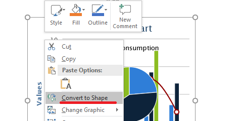

## **Adding EMZ Images to Images Collection**
Aspose.Slides for Java allows you to embed EMZ (Windows Compressed Enhanced Metafile) files in a presentation images collection. 

EMZ files are compressed image files commonly used in Microsoft Office programs. They typically contain  EMF (Enhanced Metafile) files. Normally, you can decompress an EMZ file and get an EMF file from it. 


This sample code shows you how to add an EMZ image to the images collection:

```java 
// Instantiate Presentation class that represents PPTX file
$pres = new Java("com.aspose.slides.Presentation");
try {
    ISlide slide = $pres->getSlides()->get_Item(0);

    byte[] imageFile = Files.readAllBytes(Paths.get("image.emz"));

    IPPImage image = $pres->getImages().addImage(imageFile);

    slide->getShapes().addPictureFrame(Java("com.aspose.slides.ShapeType")->Rectangle, 0, 0,
            (float) $pres->getSlideSize().getSize().getWidth(), 
			(float) $pres->getSlideSize().getSize().getHeight(), 
			image);
    $pres->save("output.pptx", SaveFormat.Pptx);
} catch (IOException e) {
} finally {
    if ($pres != null) $pres->dispose();
}
```

## **Inserting/Adding SVG into Presentations**
You can add or insert any image into a presentation by using the [addPictureFrame](https://apireference.aspose.com/slides/java/com.aspose.slides/IShapeCollection#addPictureFrame-int-float-float-float-float-com.aspose.slides.IPPImage-) method that belongs to the [IShapeCollection](https://apireference.aspose.com/slides/java/com.aspose.slides/IShapeCollection) interface.

To create an image object based on SVG image, you can do it this way:

1. Create SvgImage object to insert it to ImageShapeCollection
2. Create PPImage object from ISvgImage
3. Create PictureFrame object using IPPImage interface

This sample code shows you how to implement the steps above to add an SVG image into a presentation:
```java 
// Instantiate Presentation class that represents PPTX file
$pres = new Java("com.aspose.slides.Presentation");
try {
    String svgContent = new String(Files.readAllBytes(Paths.get("image.svg")));
    ISvgImage svgImage = new SvgImage(svgContent);
    IPPImage ppImage = $pres->getImages().addImage(svgImage);
    $pres->getSlides()->get_Item(0)->getShapes().addPictureFrame(Java("com.aspose.slides.ShapeType")->Rectangle, 0, 0, 
			ppImage.getWidth(), ppImage.getHeight(), ppImage);
    $pres->save("output.pptx", SaveFormat.Pptx);
} catch (IOException e) {
} finally {
    if ($pres != null) $pres->dispose();
}
```

## **Converting SVG to a Set of Shapes**
Aspose.Slides' conversion of SVG to a set of shapes is similar to the PowerPoint functionality used to work with SVG images:



The functionality is provided by one of the overloads of the [addGroupShape](https://apireference.aspose.com/slides/java/com.aspose.slides/IShapeCollection#addGroupShape-com.aspose.slides.ISvgImage-float-float-float-float-) method of the [IShapeCollection](https://apireference.aspose.com/slides/java/com.aspose.slides/IShapeCollection) interface that takes an [ISvgImage](https://apireference.aspose.com/slides/java/com.aspose.slides/ISvgImage) object as the first argument.

This sample code shows you how to use the described method to convert an SVG file to a set of shapes:

```java 
// Create new presentation
I$presentation = new Java("com.aspose.slides.Presentation");
try {
    // Read SVG file content
    byte[] svgContent = Files.readAllBytes(Paths.get("image.svg"));

    // Create SvgImage object
    ISvgImage svgImage = new SvgImage(svgContent);

    // Get slide size
    Dimension2D slideSize = presentation.getSlideSize().getSize();

    // Convert SVG image to group of shapes scaling it to slide size
    presentation.getSlides()->get_Item(0)->getShapes().
            addGroupShape(svgImage, 0f, 0f, (float)slideSize.getWidth(), (float)slideSize.getHeight());

    // Save presentation in PPTX format
    presentation.save("output.pptx", SaveFormat.Pptx);
} catch (IOException e) {
} finally {
    if ($presentation != null) $presentation->dispose();
}
```

## **Adding Images as EMF in Slides**
Aspose.Slides for Java allows you to generate EMF images from excel sheets and add the images as EMF in slides with Aspose.Cells. 

This sample code shows you how to perform the described task:

```java 
Workbook book = new Workbook("chart.xlsx");
Worksheet sheet = book.getWorksheets().get(0);
ImageOrPrintOptions options = new ImageOrPrintOptions();
options.setHorizontalResolution(200);
options.setVerticalResolution(200);
options.setImageType(ImageType.EMF);

//Save the workbook to stream
SheetRender sr = new SheetRender(sheet, options);
$pres = new Java("com.aspose.slides.Presentation");
try {
    $pres->getSlides().removeAt(0);
    
    String EmfSheetName = "";
    for (int j = 0; j < sr.getPageCount(); j++)
    {
    
        EmfSheetName = "test" + sheet.getName() + " Page" + (j + 1) + ".out.emf";
        sr.toImage(j, EmfSheetName);
    
        byte[] bytes = Files.readAllBytes(Paths.get(EmfSheetName));
        IPPImage emfImage = $pres->getImages().addImage(bytes);
        ISlide slide = $pres->getSlides().addEmptySlide($pres->getLayoutSlides().getByType(SlideLayoutType.Blank));
        IShape m = $slide->getShapes().addPictureFrame(Java("com.aspose.slides.ShapeType")->Rectangle, 0, 0,
					(float)pres.getSlideSize().getSize().getWidth(), 
					(float)pres.getSlideSize().getSize().getHeight(), 
					emfImage);
    }
    
    $pres->save("output.pptx", SaveFormat.Pptx);
} catch (IOException e) {
} finally {
    if ($pres != null) $pres->dispose();
}
```