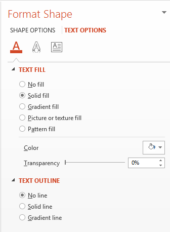
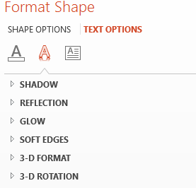

{} 

This page contains release notes for Aspose.Slides for Android via Java 20.10

{} 

|**Key**|**Summary**|**Category**|
| :- | :- | :- |
|SLIDESANDROID-244|Use Aspose.Slides for Java 20.10 features|Enhancement|


## **Public API Changes**

### **ITextFrameFormat.getThreeDFormat() and ITextFrameFormat.getTransform() methods have been added**
New [getThreeDFormat()](https://apireference.aspose.com/slides/androidjava/com.aspose.slides/ITextFrameFormat#getThreeDFormat--) and 
[getTransform()](https://apireference.aspose.com/slides/androidjava/com.aspose.slides/ITextFrameFormat#getTransform--) methods have been added to 
[ITextFrameFormat](https://apireference.aspose.com/slides/androidjava/com.aspose.slides/ITextFrameFormat) interface.
These methods allow to set 3D effect to text in [TextFrame](https://apireference.aspose.com/slides/androidjava/com.aspose.slides/TextFrame).

Methods declaration:

``` java  
/**
 * <p>
 * Returns the ThreeDFormat object that represents 3d effect properties for a text.
 * Read-only {@link IThreeDFormat}.
 * </p>
 */
public IThreeDFormat getThreeDFormat();
```
and

``` java  
/**
 * <p>
 * Gets or sets text wrapping shape.
 * Read/write {@link TextShapeType}.
 * </p>
 */
public byte getTransform();
```

The code snippet below demonstrates setting 3D effect to text:

``` java  
Presentation pres = new Presentation();
try {
    IAutoShape autoShape = pres.getSlides().get_Item(0).getShapes().addAutoShape(ShapeType.Rectangle, 10, 20, 400, 300);

    ITextFrame textFrame = autoShape.getTextFrame();

    textFrame.setText("Aspose.Slide Test Text");

    // Set text transformation
    textFrame.getTextFrameFormat().setTransform(TextShapeType.ArchUpPour);

    // Set Extrusion
    textFrame.getTextFrameFormat().getThreeDFormat().getExtrusionColor().setColor(0xFFFFA500);
    textFrame.getTextFrameFormat().getThreeDFormat().setExtrusionHeight(6);

    // Set Contour
    textFrame.getTextFrameFormat().getThreeDFormat().getContourColor().setColor(Color.RED);
    textFrame.getTextFrameFormat().getThreeDFormat().setContourWidth(1.5);

    // Set Depth
    textFrame.getTextFrameFormat().getThreeDFormat().setDepth(3);

    // Set Material
    textFrame.getTextFrameFormat().getThreeDFormat().setMaterial(MaterialPresetType.Plastic);

    // Set Lighting
    textFrame.getTextFrameFormat().getThreeDFormat().getLightRig().setDirection(LightingDirection.Top);
    textFrame.getTextFrameFormat().getThreeDFormat().getLightRig().setLightType(LightRigPresetType.Balanced);
    textFrame.getTextFrameFormat().getThreeDFormat().getLightRig().setRotation(0, 0, 40);

    // Set camera type
    textFrame.getTextFrameFormat().getThreeDFormat().getCamera().setCameraType(CameraPresetType.PerspectiveContrastingRightFacing);
} finally {
    if (pres != null) pres.dispose();
}
```

### **IPresentation.getThumbnails, ISlide.getThumbnail and ISlide.renderToGraphics methods have been overloaded**
New overloaded methods have been added to [IPresentation](https://apireference.aspose.com/slides/androidjava/com.aspose.slides/IPresentation) 
and [ISlide](https://apireference.aspose.com/slides/androidjava/com.aspose.slides/ISlide) interfaces.

Overloaded methods in [IPresentation](https://apireference.aspose.com/slides/androidjava/com.aspose.slides/IPresentation):

```java
/**
 * <p>
 * Returns a Thumbnail BufferedImage objects for all slides of a presentation.
 * </p>
 */
public android.graphics.Bitmap[] getThumbnails(IRenderingOptions options);

/**
 * <p>
 * Returns a Thumbnail BufferedImage objects for specified slides of a presentation.
 * </p>
 */
public android.graphics.Bitmap[] getThumbnails(IRenderingOptions options, int[] slides);

/**
 * <p>
 * Returns a Thumbnail BufferedImage objects for all slides of a presentation with custom scaling.
 * </p>
 */
public android.graphics.Bitmap[] getThumbnails(IRenderingOptions options, float scaleX, float scaleY);

/**
 * <p>
 * Returns a Thumbnail BufferedImage objects for specified slides of a presentation with custom scaling.
 * </p>
 */
public android.graphics.Bitmap[] getThumbnails(IRenderingOptions options, int[] slides, float scaleX, float scaleY);

/**
 * <p>
 * Returns a Thumbnail BufferedImage objects for all slides of a presentation with specified size.
 * </p>
 */
public android.graphics.Bitmap[] getThumbnails(IRenderingOptions options,Dimension imageSize);

/**
 * <p>
 * Returns a Thumbnail BufferedImage objects for specified slides of a presentation with specified size.
 * </p>
 */
public android.graphics.Bitmap[] getThumbnails(IRenderingOptions options, int[] slides,Dimension imageSize);

```

Overloaded methods in [ISlide](https://apireference.aspose.com/slides/androidjava/com.aspose.slides/ISlide):

```java
/**
 * <p>
 * Returns a Thumbnail BufferedImage object.
 * </p>
 */
public android.graphics.Bitmap getThumbnail(IRenderingOptions options);

/**
 * <p>
 * Returns a Thumbnail BufferedImage object with custom scaling.
 * </p>
 */
public android.graphics.Bitmap getThumbnail(IRenderingOptions options, float scaleX, float scaleY);

/**
 * <p>
 * Returns a Thumbnail BufferedImage object with specified size.
 * </p>
 */
public android.graphics.Bitmap getThumbnail(IRenderingOptions options, Dimension imageSize);

/**
 * <p>
 * Renders certain slide to a Graphics object.
 * </p>
 */
public void renderToGraphics(IRenderingOptions options,android.graphics.Canvas graphics);

/**
 * <p>
 * Renders certain slide to a Graphics object with custom scaling.
 * </p>
 */
public void renderToGraphics(IRenderingOptions options,android.graphics.Canvas graphics, float scaleX, float scaleY);

/**
 * <p>
 * Renders certain slide to a Graphics object using specified size.
 * </p>
 */
public void renderToGraphics(IRenderingOptions options,android.graphics.Canvas graphics, Dimension renderingSize);
```


All of these overloaded methods use [IRenderingOptions](https://apireference.aspose.com/slides/androidjava/com.aspose.slides/IRenderingOptions) as an argument 
and are used instead of old methods with [INotesCommentsLayoutingOptions](https://apireference.aspose.com/slides/androidjava/com.aspose.slides/INotesCommentsLayoutingOptions) 
argument. Old methods are marked as obsolete and will be removed after Aspose.Slides 21.4 Release.

### **IRenderingOptions interface and RenderingOptions class have been added**
[IRenderingOptions](https://apireference.aspose.com/slides/androidjava/com.aspose.slides/IRenderingOptions) interface and implementing it 
[RenderingOptions](https://apireference.aspose.com/slides/androidjava/com.aspose.slides/RenderingOptions) class have been added. 
They aggregate options used during presentation or slide rendering.

[IRenderingOptions](https://apireference.aspose.com/slides/androidjava/com.aspose.slides/IRenderingOptions) declaration:

``` java 
/**
 * <p>
 * Provides options that control how a presentation/slide is rendered.
 * </p>
 */
public interface IRenderingOptions extends ISaveOptions
{
    /**
     * <p>
     * Provides options that control how notes and comments is placed in exported document.
     * </p>
     */
    public INotesCommentsLayoutingOptions getNotesCommentsLayouting();
}
```

As it can be seen from the declaration, [IRenderingOptions](https://apireference.aspose.com/slides/androidjava/com.aspose.slides/IRenderingOptions) 
inherits [ISaveOptions](https://apireference.aspose.com/slides/androidjava/com.aspose.slides/ISaveOptions) which makes 
[getWarningCallback()](https://apireference.aspose.com/slides/androidjava/com.aspose.slides/ISaveOptions#getWarningCallback--), 
[getProgressCallback()](https://apireference.aspose.com/slides/androidjava/com.aspose.slides/ISaveOptions#getProgressCallback--) 
and [getDefaultRegularFont()](https://apireference.aspose.com/slides/androidjava/com.aspose.slides/ISaveOptions#getDefaultRegularFont--) 
methods available to specify in [RenderingOptions](https://apireference.aspose.com/slides/androidjava/com.aspose.slides/RenderingOptions) 
class instance together with [getNotesCommentsLayouting()](https://apireference.aspose.com/slides/androidjava/com.aspose.slides/RenderingOptions#getNotesCommentsLayouting--) options.

The following code sample demonstrates one of the possible use cases - getting slide thumbnails with different default font and slide's notes shown:

```java
Presentation pres = new Presentation("SomePresentation.pptx");
try {
    IRenderingOptions renderingOpts = new RenderingOptions();
    renderingOpts.getNotesCommentsLayouting().setNotesPosition(NotesPositions.BottomTruncated);

    FileOutputStream fos = null;
    try {
         fos = new FileOutputStream("SomePresentation-Slide1-Original.png");
        pres.getSlides().get_Item(0).getThumbnail(renderingOpts).compress(android.graphics.Bitmap.CompressFormat.PNG, 100, fos);
    } finally {
        if(fos != null) {
            fos.close();
        }
    }

    renderingOpts.setDefaultRegularFont("Arial Black");
    fos = null;
    try {
        fos = new FileOutputStream("SomePresentation-Slide1-ArialBlackDefault.png");
        pres.getSlides().get_Item(0).getThumbnail(renderingOpts).compress(android.graphics.Bitmap.CompressFormat.PNG, 100, fos);
    } finally {
        if(fos != null) {
            fos.close();
        }
    }

    renderingOpts.setDefaultRegularFont("Arial Narrow");
    fos = null;
    try {
        fos = new FileOutputStream("SomePresentation-Slide1-ArialNarrowDefault.png");
        pres.getSlides().get_Item(0).getThumbnail(renderingOpts).compress(android.graphics.Bitmap.CompressFormat.PNG, 100, fos);
    } finally {
        if(fos != null) {
            fos.close();
        }
    }
} finally {
    if (pres != null) pres.dispose();
}
```

### **WordArt API**

What is WordArt? WordArt is a special feature that allows users to give special effects to the text such as curved text, 3D text, color gradients, and more.

In the next examples, we will refer to similar PowerPoint commands to make the API easier to understand. Let's start with the simplest example and 
work our way up to the most complicated way of displaying text.

First, let's create a text which will be used to apply effects on it:

``` java 
Presentation pres = new Presentation();
try {
    ISlide slide = pres.getSlides().get_Item(0);
    IAutoShape autoShape = slide.getShapes().addAutoShape(ShapeType.Rectangle, 200, 200, 400, 200);
    ITextFrame textFrame = autoShape.getTextFrame();

    Portion portion = (Portion)textFrame.getParagraphs().get_Item(0).getPortions().get_Item(0);
    portion.setText("Aspose.Slides");
} finally {
    if (pres != null) pres.dispose();
}
```
To make WordArt effects more explicit and visible, let's make font height bigger:

``` java 
FontData fontData = new FontData("Arial Black");
portion.getPortionFormat().setLatinFont(fontData);
portion.getPortionFormat().setFontHeight(36);
```

Let's see how WordArt effects look in PowerPoint UI:


On the right, there are ready-made solutions that we can use, on the left - settings for creating a full-fledged WordArt object 
from the existing set of preset sets of values. The API is not a set of ready-made solutions, but a means of creating them. Therefore, you need to pay attention to the lower left part of the "WordArt Styles" menu, which contains the button for opening properties, which we will focus on in our description:



Let's use our API and set color to the text. Let it be a “SmallGrid” pattern and a 1-width black text border:

``` java 
portion.getPortionFormat().getFillFormat().setFillType(FillType.Pattern);
portion.getPortionFormat().getFillFormat().getPatternFormat().getForeColor().setColor(0xFFFFA500);
portion.getPortionFormat().getFillFormat().getPatternFormat().getBackColor().setColor(Color.WHITE);
portion.getPortionFormat().getFillFormat().getPatternFormat().setPatternStyle(PatternStyle.SmallGrid);

portion.getPortionFormat().getLineFormat().getFillFormat().setFillType(FillType.Solid);
portion.getPortionFormat().getLineFormat().getFillFormat().getSolidFillColor().setColor(Color.BLACK);
```

As a result, we get the following look of our text:


Now let's take a look on the effects that can be applied to the text via PowerPoint UI:



The above set of PowerPoint properties isn't really specific to text. Some of the properties are related to text, like Shadow, Reflection and Glow. 
And some - to the text block, like 3D Format and 3D Rotation. The Soft Edges property is usually applied to a Shape object, 
and it only has an effect when none of the 3D Format properties are set (except for the Lighting property, which would be more logical to refer 
to the scene that includes the scene position - 3D Rotation and the light falling on this scene - Lighting). 
We will return to this a bit later, but now we will deal with properties that relate specifically to the text.

Let's add a shadow effect for the text:

``` java 
portion.getPortionFormat().getEffectFormat().enableOuterShadowEffect();
portion.getPortionFormat().getEffectFormat().getOuterShadowEffect().getShadowColor().setColor(Color.BLACK);
portion.getPortionFormat().getEffectFormat().getOuterShadowEffect().setScaleHorizontal(100);
portion.getPortionFormat().getEffectFormat().getOuterShadowEffect().setScaleVertical(65);
portion.getPortionFormat().getEffectFormat().getOuterShadowEffect().setBlurRadius(4.73);
portion.getPortionFormat().getEffectFormat().getOuterShadowEffect().setDirection(230);
portion.getPortionFormat().getEffectFormat().getOuterShadowEffect().setDistance(2);
portion.getPortionFormat().getEffectFormat().getOuterShadowEffect().setSkewHorizontal(30);
portion.getPortionFormat().getEffectFormat().getOuterShadowEffect().setSkewVertical(0);
portion.getPortionFormat().getEffectFormat().getOuterShadowEffect().getShadowColor().getColorTransform().add(ColorTransformOperation.SetAlpha, 0.32f);
```

Note, Aspose.Slides API provides three types of shadows: OuterShadow, InnerShadow, and PresetShadow. 
PresetShadow is the fastest way to set the desired shadow for text using preset values. These values ​​can be seen when writing code (Intellisense). 
Unlike PowerPoint, through the API it is possible to set two types of shadows at once: InnerShadow and PresetShadow. This is how it will look:


Note, when OuterShadow and PresetShadow are set simultaneously, only OuterShadow will have an effect. 
While using OuterShadow and InnerShadow at the same time, the effect will depend on the version of PowerPoint. 
For PowerPoint 2013 it will be the double effect shown in the image above, for 2007 - only one of the effects, namely OuterShadow.

Let's add a display:

``` java 
portion.getPortionFormat().getEffectFormat().enableReflectionEffect();
portion.getPortionFormat().getEffectFormat().getReflectionEffect().setBlurRadius(0.5);
portion.getPortionFormat().getEffectFormat().getReflectionEffect().setDistance(4.72);
portion.getPortionFormat().getEffectFormat().getReflectionEffect().setStartPosAlpha(0f);
portion.getPortionFormat().getEffectFormat().getReflectionEffect().setEndPosAlpha(60f);
portion.getPortionFormat().getEffectFormat().getReflectionEffect().setDirection(90);
portion.getPortionFormat().getEffectFormat().getReflectionEffect().setScaleHorizontal(100);
portion.getPortionFormat().getEffectFormat().getReflectionEffect().setScaleVertical(-100);
portion.getPortionFormat().getEffectFormat().getReflectionEffect().setStartReflectionOpacity(60f);
portion.getPortionFormat().getEffectFormat().getReflectionEffect().setEndReflectionOpacity(0.9f);
portion.getPortionFormat().getEffectFormat().getReflectionEffect().setRectangleAlign(RectangleAlignment.BottomLeft); 
```   
Let's make this text a little shine:

``` java 
portion.getPortionFormat().getEffectFormat().enableGlowEffect();
portion.getPortionFormat().getEffectFormat().getGlowEffect().getColor().setR((byte)255);
portion.getPortionFormat().getEffectFormat().getGlowEffect().getColor().getColorTransform().add(ColorTransformOperation.SetAlpha, 0.54f);
portion.getPortionFormat().getEffectFormat().getGlowEffect().setRadius(7); 
```  
As a result, we get the following result:


You can experiment with shadow, display and glow in order to fully determine the effect of the set parameters on the displayed result.
Note, the considered properties have an effect separately on each portion of the text, i.e. if the text block contains several portions of text, then for each portion these properties can take on their own values.

Now let's move on to the properties that are inherent in the entire block of text: ThreeDFormat and Transform. Let's start with the simplest one, Transform. In our case, this property can be set in one line:

``` java 
textFrame.getTextFrameFormat().setTransform(TextShapeType.ArchUpPour);
```
as a result, we will have:


Both PowerPoint and Slides API have a number of predefined transformation types, which generally have the same names. You can see them by opening the PowerPoint menu: Format-> TextEffect-> Transform.

Let's move on to the next option for decorating text, namely 3D effects. Everything here is pretty simple. First, let's set a 3D effect for our shape:

```java
autoShape.getThreeDFormat().getBevelBottom().setBevelType(BevelPresetType.Circle);
autoShape.getThreeDFormat().getBevelBottom().setHeight(10.5);
autoShape.getThreeDFormat().getBevelBottom().setWidth(10.5);

autoShape.getThreeDFormat().getBevelTop().setBevelType(BevelPresetType.Circle);
autoShape.getThreeDFormat().getBevelTop().setHeight(12.5);
autoShape.getThreeDFormat().getBevelTop().setWidth(11);

autoShape.getThreeDFormat().getExtrusionColor().setColor(0xFFFFA500);
autoShape.getThreeDFormat().setExtrusionHeight(6);

autoShape.getThreeDFormat().getContourColor().setColor(Color.RED);
autoShape.getThreeDFormat().setContourWidth(1.5);

autoShape.getThreeDFormat().setDepth(3);

autoShape.getThreeDFormat().setMaterial(MaterialPresetType.Plastic);

autoShape.getThreeDFormat().getLightRig().setDirection(LightingDirection.Top);
autoShape.getThreeDFormat().getLightRig().setLightType(LightRigPresetType.Balanced);
autoShape.getThreeDFormat().getLightRig().setRotation(0, 0, 40);

autoShape.getThreeDFormat().getCamera().setCameraType(CameraPresetType.PerspectiveContrastingRightFacing);
```

In this case, we will see the following result:


Now let's apply a 3D effect to the text:

``` java 
textFrame.getTextFrameFormat().getThreeDFormat().getBevelBottom().setBevelType(BevelPresetType.Circle);
textFrame.getTextFrameFormat().getThreeDFormat().getBevelBottom().setHeight(3.5);
textFrame.getTextFrameFormat().getThreeDFormat().getBevelBottom().setWidth(3.5);

textFrame.getTextFrameFormat().getThreeDFormat().getBevelTop().setBevelType(BevelPresetType.Circle);
textFrame.getTextFrameFormat().getThreeDFormat().getBevelTop().setHeight(4);
textFrame.getTextFrameFormat().getThreeDFormat().getBevelTop().setWidth(4);

textFrame.getTextFrameFormat().getThreeDFormat().getExtrusionColor().setColor(0xFFFFA500);
textFrame.getTextFrameFormat().getThreeDFormat().setExtrusionHeight(6);

textFrame.getTextFrameFormat().getThreeDFormat().getContourColor().setColor(Color.RED);
textFrame.getTextFrameFormat().getThreeDFormat().setContourWidth(1.5);

textFrame.getTextFrameFormat().getThreeDFormat().setDepth(3);

textFrame.getTextFrameFormat().getThreeDFormat().setMaterial(MaterialPresetType.Plastic);

textFrame.getTextFrameFormat().getThreeDFormat().getLightRig().setDirection(LightingDirection.Top);
textFrame.getTextFrameFormat().getThreeDFormat().getLightRig().setLightType(LightRigPresetType.Balanced);
textFrame.getTextFrameFormat().getThreeDFormat().getLightRig().setRotation(0, 0, 40);

textFrame.getTextFrameFormat().getThreeDFormat().getCamera().setCameraType(CameraPresetType.PerspectiveContrastingRightFacing);
```

and get:


While adding 3D effects for text and shape where the text is placed, some considerations should be taken into account. There's some specific rule of the effect that these effects has on each other (and this is important if you want to display your effects exactly the way you want it).

This is important that 3D effect itself is divided into the object 3D representation and the scene on which this object is placed. 
So, there can be only one scene for the text and the shape containing it. Hence the following rule: if the scene is set for both the figure and the text, 
the figure scene will have a higher priority (i.e. the text scene will be ignored). The next rule - if the figure does not have its own scene, 
but have 3D representation - the text scene will be used. Otherwise (when the shape has no 3D effect at all), the shape will be flat and the 
3D effect will only be applied to the text.  Please note that the scene is related to the [ThreeDFormat.getLightRig()](https://apireference.aspose.com/slides/androidjava/com.aspose.slides/ThreeDFormat#getLightRig--) 
and [ThreeDFormat.getCamera()](https://apireference.aspose.com/slides/androidjava/com.aspose.slides/ThreeDFormat#getCamera--) methods.
