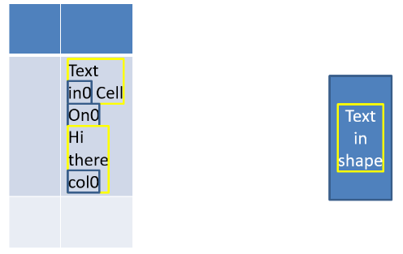

{} 

This page contains release notes for [Aspose.Slides for Java 20.2](https://repository.aspose.com/repo/com/aspose/aspose-slides/20.2/)

{} 

|**Key**|**Summary**|**Category**|
| :- | :- | :- |
|SLIDESNET-41674|Extremely slow PPT to PDF Conversion|Enhancement|
|SLIDESNET-40977|Support for getting size of paragaph and portion inside table cell text frame|Feature|
|SLIDESNET-36546|Update custom document properties directly on the source document|Feature|
|SLIDESJAVA-38029|PPT to PDF Index of connection site must be less than StartShapeConnectedTo.ConnectionSiteCount|Bug|
|SLIDESJAVA-38023|Application hangs when converting a PPTX to PDF|Bug|
|SLIDESJAVA-38024|PptxReadException on loading the file|Bug|
|SLIDESJAVA-38032|PPT to PDF Specified argument was out of the range of valid values|Bug|
|SLIDESJAVA-37999|ODP not properly converted to PDF|Bug|
|SLIDESJAVA-38025|The conversion to PDF lasts too long and causes OOM exception|Bug|
|SLIDESJAVA-37757|Out of Memory exception when saving ppt|Bug|
|SLIDESJAVA-35585|Text placed on wrong position|Bug|
|SLIDESJAVA-38026|OutOfMemoryError on AWS lambda|Bug|
|SLIDESJAVA-38027|Font style substitution|Bug|
|SLIDESJAVA-38030|PPTX to PDF PptxReadException: 0|Bug|
|SLIDESJAVA-38031|PPT to PDF Requested a name string that is not present in the font|Bug|
|SLIDESJAVA-38033|PPT to PDF rectangle cannot have width or height equal to 0|Bug|
|SLIDESJAVA-38035|PPT to PDF java.lang.StackOverflowError|Bug|
|SLIDESJAVA-38036|PPT to PDF java.lang.NullReferenceException|Bug|
|SLIDESJAVA-38037|PPT to PDF PptxReadException|Bug|
|SLIDESJAVA-38038|PPT to PDF java.lang.NullPointerException|Bug|
|SLIDESJAVA-37388|Thumbnails not properly generated|Bug|
|SLIDESJAVA-37752|Slides To PDF in AWS Lambda|Image is missing|Bug|
|SLIDESJAVA-38040|PPT to PDF PptxReadException|Bug|
|SLIDESJAVA-34394|Wrong layout slide is selected for source and cloned slides in Aspsoe.Slides generated PPT|Bug|
## **Public API Changes**
-----
### **Get Text Location in a Table Cell**
Method [**IPortion.getRect()**](https://apireference.aspose.com/java/slides/com.aspose.slides/IPortion#getRect--) has been added.
This method extends and actually replaces method [IPortion.getCoordinates()](https://apireference.aspose.com/java/slides/com.aspose.slides/IPortion#getCoordinates--) which is marked as obsolete now.
Methods [IPortion.getRect()](https://apireference.aspose.com/java/slides/com.aspose.slides/IPortion#getRect--) 
and [IParagraph.getRect()](https://apireference.aspose.com/java/slides/com.aspose.slides/IParagraph#getRect--) 
can be applied to text within table cells.

The following example shows how those properties work.
Let's say we have a table with some text inside and simple AutoShape nearby.


**The code snippet below generates those objects.**

```

 Presentation pres = new Presentation();

try

{

    ITable tbl = pres.getSlides().get_Item(0).getShapes().addTable(50, 50, new double[] { 50, 70 }, new double[] { 50, 50, 50 });

    IParagraph paragraph0 = new Paragraph();

    paragraph0.getPortions().add(new Portion("Text "));

    paragraph0.getPortions().add(new Portion("in0"));

    paragraph0.getPortions().add(new Portion(" Cell"));

    IParagraph paragraph1 = new Paragraph();

    paragraph1.setText("On0");

    IParagraph paragraph2 = new Paragraph();

    paragraph2.getPortions().add(new Portion("Hi there "));

    paragraph2.getPortions().add(new Portion("col0"));

    ICell cell = tbl.get_Item(1, 1);

    cell.getTextFrame().getParagraphs().clear();

    cell.getTextFrame().getParagraphs().add(paragraph0);

    cell.getTextFrame().getParagraphs().add(paragraph1);

    cell.getTextFrame().getParagraphs().add(paragraph2);


    IAutoShape autoShape = pres.getSlides().get_Item(0).getShapes().addAutoShape(ShapeType.Rectangle, 400, 100, 60, 120);

    autoShape.getTextFrame().setText("Text in shape");

} finally {

    if (pres != null) pres.dispose();

}

```

**The source code snippet below will add a yellow frame to all paragraphs and blue frame to all portions which contain substring "0".**

1) In the first step, We're getting coordinates of the left top corner of the table cell.

```

 double x = tbl.getX() + cell.getOffsetX();

double y = tbl.getY() + cell.getOffsetY();

```

2) In the next step we're using [IParagrap.getRect()](https://apireference.aspose.com/java/slides/com.aspose.slides/IParagraph#getRect--) and [IPortion.getRect()](https://apireference.aspose.com/java/slides/com.aspose.slides/IPortion#getRect--) methods in order to add frame to portions and paragraphs.

```

 for (IParagraph para : cell.getTextFrame().getParagraphs())

{

    if (para.getText().equals(""))

        continue;

    Rectangle2D.Float rect = para.getRect();

    IAutoShape shape =

            pres.getSlides().get_Item(0).getShapes().addAutoShape(ShapeType.Rectangle,

                    rect.getX() + (float)x, rect.getY)( + (float)y, rect.getWidth(), rect.getHeight());

    shape.getFillFormat().setFillType(FillType.NoFill);

    shape.getLineFormat().getFillFormat().getSolidFillColor().setColor(Color.YELLOW);

    shape.getLineFormat().getFillFormat().setFillType(FillType.Solid);


    for (IPortion portion : para.getPortions())

    {

        if (portion.getText().contains("0"))

        {

            rect = portion.getRect();

            shape =

                    pres.getSlides().get_Item(0).getShapes().addAutoShape(ShapeType.Rectangle,

                            rect.getX() + (float)x, rect.getY() + (float)y, rect.getWidth(), rect.getHeight());

            shape.getFillFormat().setFillType(FillType.NoFill);

        }

    }

}

```

3) Add frame to AutoShape paragraphs.

```

 for (IParagraph para : autoShape.getTextFrame().getParagraphs())

{

    Rectangle2D.Float rect = para.getRect();

    IAutoShape shape =

            pres.getSlides().get_Item(0).getShapes().addAutoShape(ShapeType.Rectangle, 

                    (float) (rect.getX() + autoShape.getX()), (float) (rect.getY() + autoShape.getY()), (float) rect.getWidth(), (float) rect.getHeight());

    shape.getFillFormat().setFillType(FillType.NoFill);

    shape.getLineFormat().getFillFormat().getSolidFillColor().setColor(Color.YELLOW);

    shape.getLineFormat().getFillFormat().setFillType(FillType.Solid);

}

```

**Result:**




