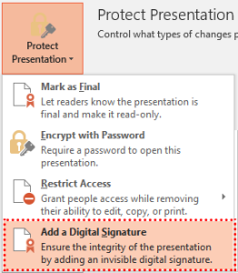
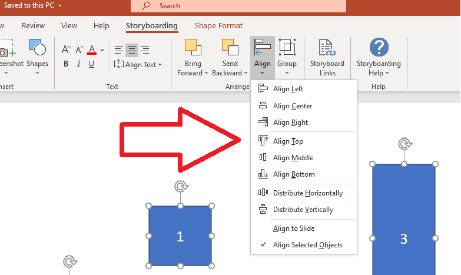
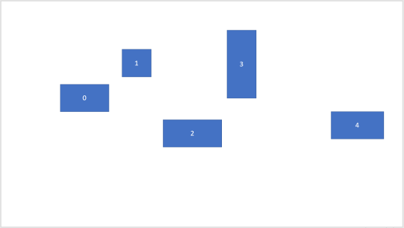
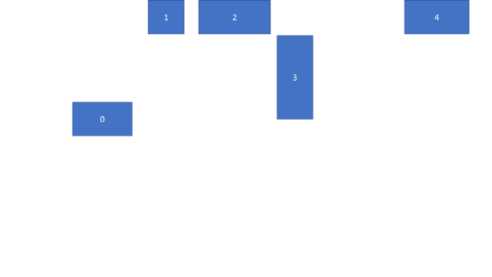

{} 

This page contains release notes for [Aspose.Slides for Java 20.5](https://repository.aspose.com/repo/com/aspose/aspose-slides/20.5/)

{} 

## **New Features and Enhancements**

|**Key**|**Summary**|**Category**|
| :- | :- | :- |
|SLIDESNET-38923|Feature to identify read protected and write protected presentations|Feature|
|SLIDESNET-41786|Add ability to validate password to modify|Feature|
|SLIDESNET-37280|Support for Mathematical Equations (OMML)|Feature|
|SLIDESNET-40011|Align Multiple shape in one line|Feature|
|SLIDESNET-38545|Get real table row height, after long text is added to cell|Enhancement|
|SLIDESNET-41621|Importing Excel EMF image has broken aspect ratio|Enhancement|
## **Other Improvements and Changes**

|**Key**|**Summary**|**Category**|
| :- | :- | :- |
|SLIDESJAVA-37950|Use Aspose.Slides for Net 20.5 features|Enhancement|
|SLIDESJAVA-36990|Align Multiple shape in one line|Feature|
|SLIDESJAVA-33889|Support for digitally signing the presentation|Feature|
|SLIDESJAVA-33613|Reading digital signatures in presentation document|Feature|
|SLIDESJAVA-37691|Does Aspose.Slides supports ECDSA and RSA algorithms for digital signature|Investigation|
|SLIDESJAVA-38079|Graph issues while converting PPTX to PDF|Bug|
|SLIDESJAVA-38065|SVG is not getting imported in slide properly|Bug|
|SLIDESJAVA-38063|Font Format 'Kerning' Applied after merging|Bug|
|SLIDESJAVA-37864|The margins are changed when converting the ODP to PPTX|Bug|
|SLIDESJAVA-37566|EMF image is not properly written as SVG|Bug|

# **Public API Changes**
### **Digital Signature in PowerPoint**
**Digital certificate** is used to create a password-protected PowerPoint presentation, marked as created by a particular organization or person. Digital certificate can be obtained by contacting an authorized organization - a certificate authority. After installing the digital certificate into the system, it can be used to add a digital signature to the presentation via File -> Info -> Protect Presentation:

The presentation may contain more than one digital signatures. After the digital signature is added to the presentation, a special message will appear in the PowerPoint:

To sign a presentation or check the authenticity of presentation signatures, Aspose.Slides API provides [**IDigitalSignature**](https://apireference.aspose.com/slides/java/com.aspose.slides/IDigitalSignature)** **interface, [**IDigitalSignatureCollection**](https://apireference.aspose.com/slides/java/com.aspose.slides/IDigitalSignatureCollection) interface and[ ](https://apireference.aspose.com/net/slides/aspose.slides/ipresentation/properties/digitalsignatures)[**IPresentation**](https://apireference.aspose.com/slides/java/com.aspose.slides/IPresentation)**.[getDigitalSignatures()](https://apireference.aspose.com/slides/java/com.aspose.slides/IPresentation#getDigitalSignatures--)** method. Currently, digital signatures are supported for PPTX format only.

##### **Add Digital Signature from PFX Certificate**
The code sample below demonstrates how to add a digital signature from a PFX certificate:

1. Open PFX file and pass the PFX password to [**DigitalSignature**](https://apireference.aspose.com/slides/java/com.aspose.slides/DigitalSignature)** **object.

2. Add a created signature to the presentation object.



Presentation pres = new Presentation();
try {
    // Create DigitalSignature object with PFX file and PFX password 
    DigitalSignature signature = new DigitalSignature("testsignature1.pfx", "testpass1");

    // Comment new digital signature
    signature.setComments("Aspose.Slides digital signing test.");

    // Add digital signature to presentation
    pres.getDigitalSignatures().add(signature);

    // Save presentation
    pres.save("SomePresentationSigned.pptx", SaveFormat.Pptx);
} finally {
    if (pres != null) pres.dispose();
}


Now its possible to check if the presentation was digitally signed and has not been modified:


// Open presentation
Presentation pres = new Presentation("SomePresentationSigned.pptx");
try {
    if (pres.getDigitalSignatures().size() > 0)
    {
        boolean allSignaturesAreValid = true;

        System.out.println("Signatures used to sign the presentation: ");

        // Check if all digital signatures are valid
        for (IDigitalSignature signature : pres.getDigitalSignatures())
        {
            System.out.println(signature.getComments() + ", "
                + signature.getSignTime().toString() + " -- " + (signature.isValid() ? "VALID" : "INVALID"));
            allSignaturesAreValid &= signature.isValid();
        }

        if (allSignaturesAreValid)
            System.out.println("Presentation is genuine, all signatures are valid.");
        else 
            System.out.println("Presentation has been modified since signing.");
    }
} finally {
    if (pres != null) pres.dispose();
}

-----
### **IDigitalSignatureCollection interface and DigitalSignatureCollection class have been added**
[**DigitalSignatureCollection**](https://apireference.aspose.com/slides/java/com.aspose.slides/DigitalSignatureCollection) class has been added. It implements [**IDigitalSignatureCollection**](https://apireference.aspose.com/slides/java/com.aspose.slides/IDigitalSignatureCollection) interface and represents a collection of digital signatures that were used or will be used to sign the presentation.

[**IDigitalSignatureCollection**](https://apireference.aspose.com/slides/java/com.aspose.slides/IDigitalSignatureCollection) declaration:


/**
  * 

  * Represents a collection of digital signatures attached to a document.
  * 

  */
public interface IDigitalSignatureCollection extends IGenericCollection<IDigitalSignature>
{
    /**
      * 

      * Returns the signature by index.
      * 

      */
    public IDigitalSignature get_Item(int index);

    /**
      * 

      * Adds the signature at the end of collection.
      * 

      * @param digitalSignature Signature to add.
      */
    public void add(IDigitalSignature digitalSignature);

    /**
      * 

      * Removes the signature at the specified index.
      * 

      * @param index Index of the signature that should be deleted.
      */
    public void removeAt(int index);

    /**
      * 

      * Removes all signatures from collection.
      * 

      */
    public void clear();
}



Please see [this note](#DigitalSignature) for code samples.

-----
### **IDigitalSignature interface and DigitalSignature class have been added**
[**DigitalSignature**](https://apireference.aspose.com/slides/java/com.aspose.slides/DigitalSignature)** **class has been added. It implements [**IDigitalSignature**](https://apireference.aspose.com/slides/java/com.aspose.slides/IDigitalSignature)** **interface and stores the information about digital signature based on certificate used or will be used to sign the presentation.

[**IDigitalSignature**](https://apireference.aspose.com/slides/java/com.aspose.slides/IDigitalSignature) declaration:



/**
   * 

   * Digital signature in signed file.
   * 

   */
public interface IDigitalSignature 
{
    /**
    * 

    * Certificate object that was used to sign the document.
    * Read-only {@link byte[]}.
    * 

    */
    public byte[] getCertificate();

    /**
    * 

    * If this digital signature is valid and the document has not been tampered with, this value will be true.
    * Read-only {@code boolean}.
    * 

    */
    public boolean isValid();

    /**
    * 

    * The time when the document was signed.
    * Read-only {@link java.util.Date}.
    * 

    */
    public java.util.Date getSignTime();

    /**
    * 

    * The purpose of signature.
    * Read/write {@link String}.
    * 

    */
    public String getComments();
    public void setComments(String value);
}


Please see [this note](#DigitalSignature) for code samples.

-----
### **IPresentation.getDigitalSignatures() method has been added**
[**getDigitalSignatures()**](https://apireference.aspose.com/slides/java/com.aspose.slides/IPresentation#getDigitalSignatures--) method has been added to [**IPresentation**](https://apireference.aspose.com/slides/java/com.aspose.slides/IPresentation) interface and [**Presentation**](https://apireference.aspose.com/slides/java/com.aspose.slides/Presentation) class. It allows to access a collection of digital signatures which have been used to sign or add digital signatures which will be used to sign the presentation.

Method declaration:



/**
   * 

   * Returns the collection of signatures used to sign the presentation.
   * Read-only {@link IDigitalSignatureCollection}.
   * 

   */
public final IDigitalSignatureCollection getDigitalSignatures()


Please see [this note](#DigitalSignature) for code samples.

-----
### **Check a Write Protection Password via IPresentationInfo interface**
[**isWriteProtected()** ](https://apireference.aspose.com/slides/java/com.aspose.slides/IPresentationInfo#isWriteProtected--)and [**checkWriteProtection()**](https://apireference.aspose.com/slides/java/com.aspose.slides/IPresentationInfo#checkWriteProtection-java.lang.String-)** **methods have been added to [**IPresentationInfo**](https://apireference.aspose.com/slides/java/com.aspose.slides/IPresentationInfo)** **interface and [**PresentationInfo**](https://apireference.aspose.com/slides/java/com.aspose.slides/PresentationInfo)** **class. These methods allow checking whether a presentation is protected by a password to modify. The password to restrict modifying is intended to set write protection on the presentation. Write protection restricts the ability to save the presentation to the same path using host applications.

[**isWriteProtected()**](https://apireference.aspose.com/slides/java/com.aspose.slides/IPresentationInfo#isWriteProtected--)** **and [**checkWriteProtection()**](https://apireference.aspose.com/slides/java/com.aspose.slides/IPresentationInfo#checkWriteProtection-java.lang.String-)** **declarations:


/**
   * 

   * Gets a value that indicates whether a binded presentation is write protected.
   * 

   * If the presentation is protected by a password to open, the property value equals NotDefined.
   * See {@link NullableBool} enumeration.
   */
public byte isWriteProtected();

/**
   * 

   * Checks whether a password to modify is correct for a write protected presentation.
   * 

   * @return
   * True if the presentation is write protected and the password is correct. False otherwise.
   * @exception InvalidOperationException
   * If a presentation is protected by a password to open or format does not support write protection
   * @param password The password to check.
   * 

   * 1. You should check the {@code IsWriteProtected}({@link #isWriteProtected}) property before calling this method.
   * 2. When password is null or empty, this method returns false.
   * 

   */
public boolean checkWriteProtection(String password);


##### **Example**
The example below demonstrates how to check a password to restrict modifying the presentation:



IPresentationInfo info = PresentationFactory.getInstance().getPresentationInfo(presentationFilePath);
boolean isWriteProtectedByPassword = info.isWriteProtected() == NullableBool.True && info.checkWriteProtection("my_password");


-----
### **Check a Write Protection Password via IProtectionManager interface**
[**checkWriteProtection()** ](https://apireference.aspose.com/slides/java/com.aspose.slides/IProtectionManager#checkWriteProtection-java.lang.String-)method has been added to the [**IProtectionManager**](https://apireference.aspose.com/slides/java/com.aspose.slides/IProtectionManager)** **interface and [**ProtectionManager**](https://apireference.aspose.com/slides/java/com.aspose.slides/ProtectionManager)** **class. This method allows checking whether a presentation is protected by a password from modifying. The password to restrict modifying is intended to set write protection on the presentation. Write protection restricts the ability to save the presentation to the same path using host applications.

Method declaration:



/**
   * 

   * Determines whether a presentation is a password protected to modify.
   * 

   * @return True if the password is valid; otherwise, false.
   * @param password The password for checking.
   * 

   * 1. You should check the {@code isWriteProtected}({@link #isWriteProtected}) method before calling this method.
   * 2. When the password is null or empty, this method returns false.
   * 

   */
public boolean checkWriteProtection(String password);


##### **Example**
The example below demonstrates how to check a password that restricts modifying the presentation:


Presentation presentation = new Presentation(presentationFilePath);
try {
    boolean isWriteProtected = presentation.getProtectionManager().checkWriteProtection("my_password");
} finally {
    if (presentation != null) presentation.dispose();
}

-----
### **Check Protection to Open Presentation via IPresentationInfo interface**
[**isPasswordProtected()**](https://apireference.aspose.com/slides/java/com.aspose.slides/IPresentationInfo#isPasswordProtected--)** **method has been added to [**IPresentationInfo**](https://apireference.aspose.com/slides/java/com.aspose.slides/IPresentationInfo) interface and [**PresentationInfo**](https://apireference.aspose.com/slides/java/com.aspose.slides/PresentationInfo)** **class. This property allows checking whether a presentation is protected from opening. The presentation has an open protection when the password is set to the document.

Method declaration:


/**
   * 

   * Gets a value that indicates whether a binded presentation is protected by a password to open.
   * 

   */
public boolean isPasswordProtected();

##### **Example**
The example below demonstrates how to check protection to open:


IPresentationInfo info = PresentationFactory.getInstance().getPresentationInfo(presentationFilePath);
if (info.isPasswordProtected())
{
    System.out.println("The presentation '" + presentationFilePath + "' is protected by password to open.");
}

-----
### **Support for Shapes Alignment has been added**
The feature helps to change the placement of selected shapes on the slide. Aligns shapes to the margins or the edge of the slide or align them relative to each other.

To provide options from the picture above has been added overloaded method **[SlideUtil](https://apireference.aspose.com/slides/java/com.aspose.slides/SlideUtil).[alignShapes()](https://apireference.aspose.com/slides/java/com.aspose.slides/SlideUtil#alignShapes-int-boolean-com.aspose.slides.IBaseSlide-int:A-)** and [**ShapesElignmentType**](https://apireference.aspose.com/slides/java/com.aspose.slides/ShapesAlignmentType) class.

##### **ShapesElignmentType Enum**
The [**ShapesElignmentType**](https://apireference.aspose.com/slides/java/com.aspose.slides/ShapesAlignmentType)** **determines the way to align shapes. Possible values for [**ShapesElignmentType**](https://apireference.aspose.com/slides/java/com.aspose.slides/ShapesAlignmentType)** **: [*AlignLeft*](https://apireference.aspose.com/slides/java/com.aspose.slides/ShapesAlignmentType#AlignLeft)*, [AlignRight](https://apireference.aspose.com/slides/java/com.aspose.slides/ShapesAlignmentType#AlignRight), [AlignCenter](https://apireference.aspose.com/slides/java/com.aspose.slides/ShapesAlignmentType#AlignCenter), [AlignTop](https://apireference.aspose.com/slides/java/com.aspose.slides/ShapesAlignmentType#AlignTop), [AlignMiddle](https://apireference.aspose.com/slides/java/com.aspose.slides/ShapesAlignmentType#AlignMiddle), [AlignBottom](https://apireference.aspose.com/slides/java/com.aspose.slides/ShapesAlignmentType#AlignBottom), [DistributeHorizontally](https://apireference.aspose.com/slides/java/com.aspose.slides/ShapesAlignmentType#DistributeHorizontally), [DistributeVertically](https://apireference.aspose.com/slides/java/com.aspose.slides/ShapesAlignmentType#DistributeVertically)*.

##### **SlideUtil.alignShape() Method**
The method changes the placement of selected shapes on the slide. Input parameters:

- [*ShapesAlignmentType*](https://apireference.aspose.com/slides/java/com.aspose.slides/ShapesAlignmentType) **alignmentType** - determines which type of alignment will be applied.
- *boolean* **alignToSlide**- if true, shapes will be aligned relative to the slide edges, otherwise shapes will be aligned relative to each other.
- [*IBaseSlide*](https://apireference.aspose.com/slides/java/com.aspose.slides/IBaseSlide) **slide** - parent slide.
- *int[]* **shapeIndexes** - indexes of shapes to be aligned.
- [*IShapeCollection*](https://apireference.aspose.com/slides/java/com.aspose.slides/IShapeCollection)* ***shapes** - a collection of shapes to be aligned.
##### **Example 1**

Let's say we want to align shapes with indexes 1, 2 and 4 along the top border of the slide.

##### **Solution**

Presentation pres = new Presentation("example.pptx");
try {
    ISlide slide = pres.getSlides().get_Item(0);
    IShape shape1 = slide.getShapes().get_Item(1);
    IShape shape2 = slide.getShapes().get_Item(2);
    IShape shape3 = slide.getShapes().get_Item(4);
    SlideUtil.alignShapes(ShapesAlignmentType.AlignTop, true, pres.getSlides().get_Item(0), new int[]
      {
        slide.getShapes().indexOf(shape1),
        slide.getShapes().indexOf(shape2),
        slide.getShapes().indexOf(shape3)
      });
} finally {
    if (pres != null) pres.dispose();
}


##### **Example 2**
Another option shows how to align the entire collection of shapes on the slide:



Presentation pres = new Presentation("example.pptx");
try {
    SlideUtil.alignShapes(ShapesAlignmentType.AlignBottom, false, pres.getSlides().get_Item(0).getShapes());
} finally {
    if (pres != null) pres.dispose();
}

-----

