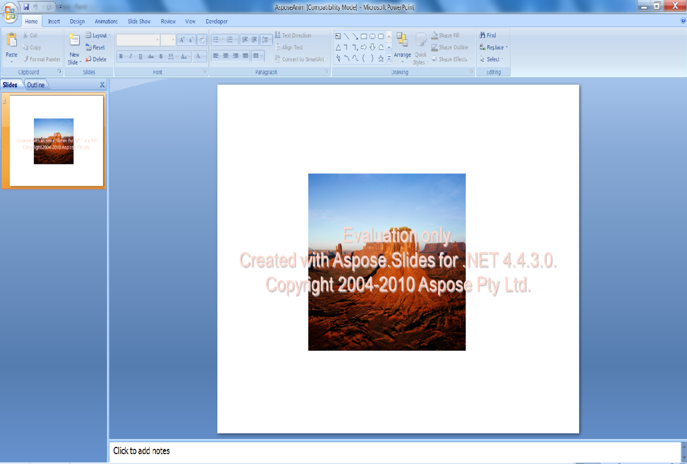

{} 

Picture frames are applied to shapes or images in Microsoft PowerPoint to frame images in a presentation. This article shows how to create a picture frame and apply animation on it programmatically using first [VSTO 2008](/slides/net/adding-picture-frame-with-animation/) and then [Aspose.Slides for .NET](/slides/net/adding-picture-frame-with-animation/). First, we show you how to apply a frame and animation using VSTO 2008. We then show you how to perform the same steps using Aspose.Slides for .NET.

{} 
### **Adding Picture Frames with Animation**
The code samples below create a presentation with a slide, add an image with a picture frame and applies animation to it.
#### **VSTO 2008 Example**
Using VSTO 2008, take the following steps:

1. Create a presentation.
1. Add an empty slide.
1. Add a picture shape to the slide.
1. Apply animation to the picture.
1. Write the presentation to disk.

**The output presentation, created with VSTO** 


#### **Aspose.Slides for .NET Example**
Using Aspose.Slides for .NET, perform the following steps:

1. Create a presentation.
1. Access the first slide.
1. Add an image to a picture collection.
1. Add a picture shape to the slide.
1. Apply animation to the picture.
1. Write the presentation to disk.

**The output presentation, created with Aspose.Slides** 


