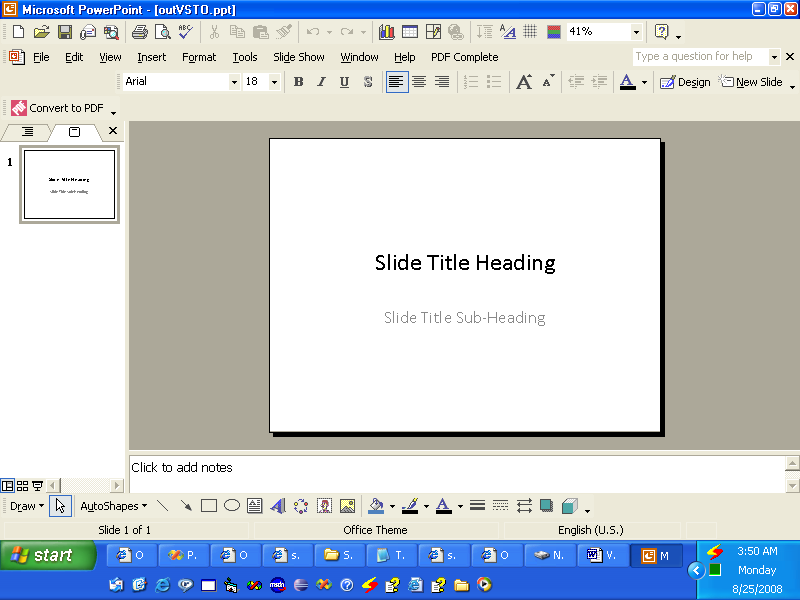

{} 

VSTO was developed to let developers build applications that could run inside Microsoft Office. VSTO is COM-based but it's wrapped inside a .NET object so that it can be used in .NET applications. VSTO needs .NET framework support as well as Microsoft Office CLR-based runtime. Although it can be used for making Microsoft Office add-ins it is nearly impossible to use as a server-side component. It also has serious deployment problems.

Aspose.Slides for .NET is a component that can be used to manipulate Microsoft PowerPoint presentations, just like VSTO, but it has several advantages:

- Aspose.Slides contains managed code only and doesn’t require Microsoft Office runtime to be installed.
- It can be used as a client-side component or as a server side component.
- Deployment is easy since Aspose.Slides is contained in a single DLL.

{} 
### **Creating a Presentation**
Below are two code examples that illustrate how VSTO and Aspose.Slides for .NET can be used to achieve the same goal. The first example is [VSTO](/slides/net/create-a-new-presentation/); [the second example](/slides/net/create-a-new-presentation/) uses Aspose.Slides.
#### **VSTO Example**
**The VSTO output** 


#### **Aspose.Slides for .NET Example**
**The output from Aspose.Slides** 


