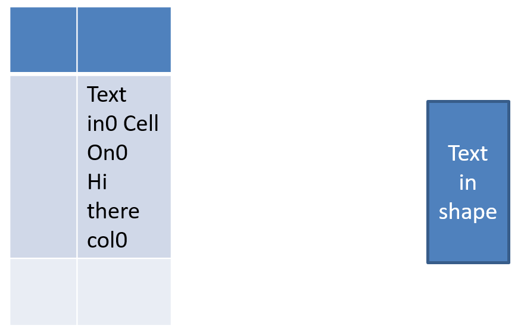

{} 

This page contains release notes for [Aspose.Slides for .NET 20.2](https://www.nuget.org/packages/Aspose.Slides.NET/20.2.0).

{} 

|**Key**|**Summary**|**Category**|
| :- | :- | :- |
|SLIDESNET-41521|Wrong shape fill color|Investigation|
|SLIDESNET-41674|Extremely slow PPT to PDF Conversion|Feature|
|SLIDESNET-40977 |Support for getting size of paragaph and portion inside table cell text frame|Feature|
|SLIDESNET-36546 |Update custom document properties directly on the source document|Feature|
|SLIDESNET-41347 |Same result when saving without and with excluding fonts|Bug|
|SLIDESNET-41686 |Unknown decision exception when saving into HTML with different ILinkEmbedController implementations|Bug|
|SLIDESNET-41532 |On conversion to PDF on dotnet-Linux platform images are missing|Bug|
|SLIDESNET-41695|PptxReadException on loading the file|Bug|
|SLIDESNET-41669|The infinite loop on resaving the PTTX file|Bug|
|SLIDESNET-41725 |PPT to PDF java.lang.NullPointerException|Bug|
|SLIDESNET-41697|The conversion to PDF lasts too long|Bug|
|SLIDESNET-41719 |PPT to PDF rectangle cannot have width or height equal to 0|Bug|
|SLIDESNET-41720 |PPT to PDF Index of connection site must be less than StartShapeConnectedTo.ConnectionSiteCount|Bug|
|SLIDESNET-41717|PPT to PDF throws StackOverflowError|Bug|
|SLIDESNET-41716 |PPT to PDF PptxReadException|Bug|
|SLIDESNET-41610|Text boxes are cut off on converting PPTX to SVG|Bug|
|SLIDESNET-41715|PPT to PDF PptxReadException|Bug|
|SLIDESNET-41609|Text overlaps on converting PPTX to SVG|Bug|
|SLIDESNET-41723|PPT to PDF Requested a name string that is not present in the font|Bug|
|SLIDESNET-41722 |PPT to PDF Specified argument was out of the range of valid values|Bug|
|SLIDESNET-41664|Issue with the graph while resaving PPTX|Bug|
|SLIDESNET-41724|PPT to PDF java.lang.NullReferenceException|Bug|
|SLIDESNET-35593|Slide master gets changed after saving|Bug|
|SLIDESNET-37830|WordArt changes after saving ppt|Bug|
|SLIDESNET-37832|Title position is changed on saving presentation|Bug|
|SLIDESNET-41640|ODP not properly converted to PDF|Bug|
|SLIDESNET-41681|Aspose Slides HTML EMF Images Missing (Windows Environment)|Bug|
|SLIDESNET-41332 |Part of EMF image is missing in generated PDF with Notes|Bug|
|SLIDESNET-41727 |Missing content in PDF file|Bug|
|SLIDESNET-41612|Exception on loading Presentation|Bug|
|SLIDESNET-41533|Image missing in slide thumbanail|Bug|
|SLIDESNET-41688|Exception on saving presentaiton|Bug|
|SLIDESNET-41665|Exception: NullReferenceException on embedding OTF font|Bug|
|SLIDESNET-41694 |Application hangs when converting a PPTX to PDF|Bug|
|SLIDESNET-37474 |Improper table rendering in generated PDF|Bug|
|SLIDESNET-41525|Exception on converting Presentation to PDF|Bug|
|SLIDESNET-41673|Export to PDF never completes|Bug|
|SLIDESNET-41676 |Wrong font is embedded in exported PDF|Bug|
|SLIDESNET-41564 |Exception on saving presentation with table to PDF|Bug|
|SLIDESNET-41683 |Method WriteAsSvg terminates linux docker container when invoked a second time for the same slide (.NET Core Linux)|Bug|
|SLIDESNET-40596|OutOfMemory is thrown for converting to PDF in Azure|Bug|
|SLIDESNET-41566|Chart (emf) missing when converting pptx to pdf|Bug|
|SLIDESNET-41710|Aspose.Slides PptxReadException when create presentation with comments|Bug|
|SLIDESNET-40649|Thumbnails not properly generated|Bug|
|SLIDESNET-37730|Text placed on wrong position in generated thumbnail|Bug|
|SLIDESNET-40984 |Convertering slide with image to PDF disapper the image|Bug|
## **Public API Changes**
### **Slides on Android via Xamarin**
Xamarin is the set of tools and libraries that extend .NET and allows to build applications for Android using C# and Visual Studio. We have added support for Xamarin platform, and now you can use it to build your C# application with Aspose.Slides for Android.
### **Get Text Location in a Table Cell**
Method **IPortion.GetRect()** has been added. This method extends and actually replaces method IPortion.GetCoordinates() which is marked as obsolete now.

Methods IPortion.GetRect() and IParagraph.GetRect() can be applied to text within table cells. The following example shows how the properties work.

Let's say, we have a table with some text inside and a simple AutoShape nearby.

The code snippet below generates these objects:



    using (Presentation pres = new Presentation())

           {

                ITable tbl = pres.Slides[0].Shapes.AddTable(50, 50, new double[] { 50, 70 }, new double[] { 50, 50, 50 });

                IParagraph paragraph0 = new Paragraph();

                paragraph0.Portions.Add(new Portion("Text "));

                paragraph0.Portions.Add(new Portion("in0"));

                paragraph0.Portions.Add(new Portion(" Cell"));

                IParagraph paragraph1 = new Paragraph();

                paragraph1.Text = "On0";

                IParagraph paragraph2 = new Paragraph();

                paragraph2.Portions.Add(new Portion("Hi there "));

                paragraph2.Portions.Add(new Portion("col0"));

                ICell cell = tbl.Rows[1][1];

                cell.TextFrame.Paragraphs.Clear();

                cell.TextFrame.Paragraphs.Add(paragraph0);

                cell.TextFrame.Paragraphs.Add(paragraph1);

                cell.TextFrame.Paragraphs.Add(paragraph2);

                IAutoShape autoShape = pres.Slides[0].Shapes.AddAutoShape(ShapeType.Rectangle, 400, 100, 60, 120);

                autoShape.TextFrame.Text = "Text in shape";

           }



**The source code snippet below will add a yellow frame to all paragraphs and a blue frame to all portions which contain substring "0".**

1) First, we get coordinates of the left top corner of the table cell:



 double x = tbl.X + cell.OffsetX;

double y = tbl.Y + cell.OffsetY;



2) Then, we use IParagrap.GetRect() and IPortion.GetRect() methods to add frame to portions and paragraphs:



              foreach (IParagraph para in cell.TextFrame.Paragraphs)

                {

                   if (para.Text == "")

                       continue;

                   RectangleF rect = para.GetRect();

                   IAutoShape shape =

                       pres.Slides[0].Shapes.AddAutoShape(ShapeType.Rectangle,

                           rect.X + (float)x, rect.Y + (float)y, rect.Width, rect.Height);

                   shape.FillFormat.FillType = FillType.NoFill;

                   shape.LineFormat.FillFormat.SolidFillColor.Color = Color.Yellow;

                   shape.LineFormat.FillFormat.FillType = FillType.Solid;

                   foreach (IPortion portion in para.Portions)

                    {

                       if (portion.Text.Contains("0"))

                        {

                           rect = portion.GetRect();

                           shape =

                               pres.Slides[0].Shapes.AddAutoShape(ShapeType.Rectangle,

                                   rect.X + (float)x, rect.Y + (float)y, rect.Width, rect.Height);

                           shape.FillFormat.FillType = FillType.NoFill;

                        }

                    }

                }



3) Now we should add a frame to AutoShape paragraphs:



      foreach (IParagraph para in autoShape.TextFrame.Paragraphs)

               {

                    RectangleF rect = para.GetRect();

                    IAutoShape shape =

                        pres.Slides[0].Shapes.AddAutoShape(ShapeType.Rectangle,

                            rect.X + autoShape.X, rect.Y + autoShape.Y, rect.Width, rect.Height);

                    shape.FillFormat.FillType = FillType.NoFill;

                    shape.LineFormat.FillFormat.SolidFillColor.Color = Color.Yellow;

                    shape.LineFormat.FillFormat.FillType = FillType.Solid;

               }



**Result**:

