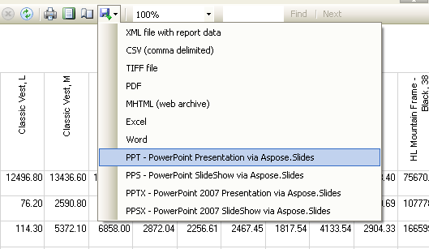

{} 

This article explains how to integrate Aspose.Slides for Reporting Services manually with Visual Studio. 

{} 
### **Integrating Aspose.Slides for Reporting Services with Visual Studio**
To install Aspose.Slides for Reporting Services manually for Microsoft Visual Studio Report Designer without the MSI installer. We recommend you use the MSI installer because it performs all necessary installation and configuration automatically. However, if you fail to install with MSI installer then please follow the following guidelines. 

This article describes how to install Aspose.Slides for Reporting Services on a computer with Business Intelligence Development Studio. This will enable you to export reports to Microsoft PowerPoint formats at design time from the Microsoft Visual Studio 2005 or 2008 Report Designer. 

1. Copy Aspose.Slides.ReportingServices.dll to the Visual Studio directory.
- To integrate with Visual Studio 2005 Report Designer, copy **Aspose.Slides.ReportingServices.dll** to the **C:\Program Files\Microsoft Visual Studio 8\Common7\IDE\PrivateAssemblies** directory.
- To integrate with Visual Studio 2008 Report Designer, copy **Aspose.Slides.ReportingServices.dll** to the **C:\Program Files\Microsoft Visual Studio 9.0\Common7\IDE\PrivateAssemblies** directory.
1. Register Aspose.Slides for Reporting Services as a rendering extension. 
   1. Open **C:\Program Files\Microsoft Visual Studio <Version>\Common7\IDE\PrivateAssemblies\ RSReportDesigner.config** (where <Version> is “8” for Visual Studio 2005 or “9.0” for Visual Studio 2008) and add the following lines into the <Render> element: 



 <Extension Name="ASPPT" Type="Aspose.Slides.ReportingServices.PptRenderer,Aspose.Slides.ReportingServices"/>

<Extension Name="ASPPS" Type="Aspose.Slides.ReportingServices.PpsRenderer,Aspose.Slides.ReportingServices"/>

<Extension Name="ASPPTX" Type="Aspose.Slides.ReportingServices.PptxRenderer,Aspose.Slides.ReportingServices"/>

<Extension Name="ASPPSX" Type="Aspose.Slides.ReportingServices.PpsxRenderer,Aspose.Slides.ReportingServices"/>



1. Give Aspose.Slides for Reporting Services permissions to execute. 
   1. Open **C:\Program Files\Microsoft Visual Studio <Version>\Common7\IDE\PrivateAssemblies\RSPreviewPolicy.config** (where <Version> is “8” for Visual Studio 2005 or “9.0” for Visual Studio 2008).
   1. Add the following as the last item in the second to outer <CodeGroup> element (which should be <CodeGroup class="FirstMatchCodeGroup" version="1" PermissionSetName="Execution" Description="This code group grants MyComputer code Execution permission.">) 

**<CodeGroup>**



...

  <CodeGroup>

    ...

    <!--Start here.-->

    <CodeGroup

        class="UnionCodeGroup"

        version="1"

        PermissionSetName="FullTrust"

        Name="Aspose.Slides_for_Reporting_Services"

        Description="This code group grants full trust to the AS4SSRS assembly.">

        <IMembershipCondition

            class="StrongNameMembershipCondition"

            version="1"

            PublicKeyBlob="00240000048000009400000006020000002400005253413100040000010001005542e

            99cecd28842dad186257b2c7b6ae9b5947e51e0b17b4ac6d8cecd3e01c4d20658c5e4ea1b9a6c8f854b2

            d796c4fde740dac65e834167758cff283eed1be5c9a812022b015a902e0b97d4e95569eb8c0971834744

            e633d9cb4c4a6d8eda03c12f486e13a1a0cb1aa101ad94943236384cbbf5c679944b994de9546e493bf" />

    </CodeGroup>

    <!--End here.-->

  </CodeGroup>

</CodeGroup>



1. Verify that Aspose.Slides for Reporting Services was installed successfully. 
   1. Run or restart Microsoft Visual Studio 2005 or 2008 Report Designer. You should notice new formats available in the list of export formats.

**New export formats appear in Report Designer.** 

