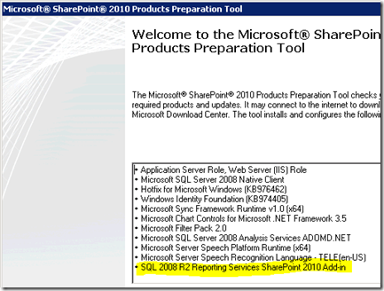

{} 

Following perquisites are needed to be met before we proceed with installation. 

{} 
#### **Reporting Services Add-In for SharePoint**
The **Reporting Services Add-In for SharePoint** is one of the key components to getting Integration wo rking properly. The Add-In has to be installed on any of the **Web Front Ends (WFE)** that is in your SharePoint farm along with the Central Admin server. One of the new changes with SQL 2008 R2 & SharePoint 2010 is that the 2008 R2 Add-In is now a pre-req for the SharePoint Install. This means that the RS Add-In will be laid down when you go to install SharePoint. It has bee n shown and highlighted in figure below. This actually avoids many issues we saw with SP 2007 and RS 2008 when installing the Add-In. 

**Figure 1**: Reporting Services Add-In for SharePoint 
#### **SharePoint Authentication**
Before jumping into the RS Integration pieces, one thing is important and is to be taken care of is that how you setup your **Site** in SharePoint Farm. More specifically how you configure authentication for the Site; whether it will be **Classic** or **Claims** . This choice is important in the beginning. I do not believe that you can change this option once it is done. If you can change it, it would not be a simple process. 

{} 

Reporting Services 2008 R2 is NOT Claims aware 

{} 

Even if you choose your SharePoint site to use **Claims** , Reporting Services itself is not Claims aware. It does affect how authentication works with Reporting Services. So, what is the difference from a Reporting Services perspective? It comes down to whether you want to forward User Credentials to the datasource. 

***Classic***   - Can use Kerberos and forward the user's credentials to your back end datasource (will need to use Kerberos for that. 

***Claims*** ** - A Claims token is used and not a windows token. RS will always use Trusted Authentication in this scenario and will only have access to the SPUser token. You will need to store your credentials within your data source. 

For now, we just want to focus on setup of RS. At this point SharePoint is installed on SharePoint Box and setup with a **Classic Auth Site** on **port 80** . Moreover, on the RS Server I have **just installed Reporting Services** and that's it. 
